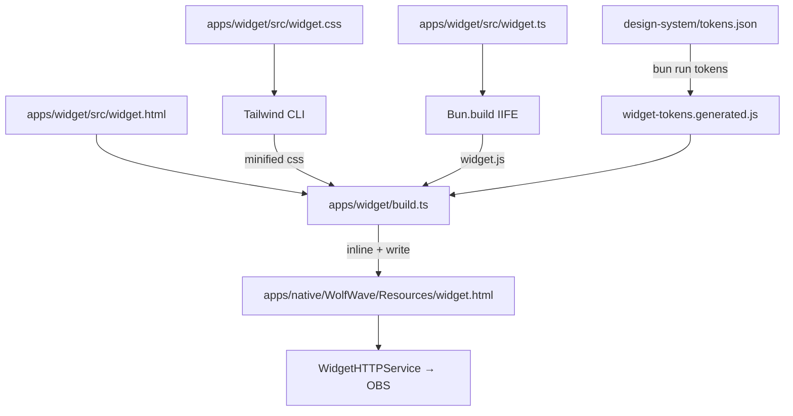

**The OBS overlay is one self-contained HTML file** at
`apps/native/WolfWave/Resources/widget.html`. The native app bundles it, and
`WidgetHTTPService` serves it to OBS Browser Source clients.

**Don't edit that file directly.** The real source is a Tailwind + TypeScript
workspace at `apps/widget/`. The bundled HTML is a generated artifact, produced
by the explicit Bun build or by CI. Xcode bundles the committed artifact; it
does not rebuild it.

## Architecture


```mermaid
flowchart TD
    A[design-system/tokens.json] -->|bun run tokens| B[widget-tokens.generated.js]
    C[apps/widget/src/widget.html] --> D[apps/widget/build.ts]
    E[apps/widget/src/widget.css] --> F[Tailwind CLI]
    G[apps/widget/src/widget.ts] --> H[Bun.build IIFE]
    F -->|minified css| D
    H -->|widget.js| D
    B --> D
    D -->|inline + write| I[apps/native/WolfWave/Resources/widget.html]
    I --> J[WidgetHTTPService → OBS]
```

Everything lands in one HTML file: `<style>`, the tokens `<script>`, and the
runtime `<script>` all inlined. No `<link>`, no `<script src>`, no extra HTTP
round-trips. The supported path is the local HTTP URL exposed by WolfWave, which
also bootstraps the authenticated WebSocket connection.

## Message contract

The browser widget consumes the server-to-client messages from the shared,
bidirectional WebSocket service. Stream Deck commands use the reverse direction;
the browser widget itself is receive-only. Schemas are frozen by the test suite.
Adding fields server-side is safe; renaming fields requires a coordinated change.

| Type | Payload | Cadence |
|------|---------|---------|
| `welcome` | `{}` | Once on connect |
| `now_playing` | `{ track, artist, album, duration, elapsed, isPlaying, artworkURL }` | Track change |
| `progress` | `{ elapsed, duration, isPlaying }` | ~1 Hz |
| `playback_state` | `{ isPlaying, track?, artist?, album? }` | State change |
| `overlay_visibility` | `{ visible }` | Stream Deck visibility toggle |
| `widget_config` | `{ theme, layout, textColor, backgroundColor, fontFamily }` | Settings change |

The browser widget never sends back. The native app pushes, the browser renders.

## Paused playback

When Music.app reports the loaded track as paused (`kPSp`), the widget stays
on stream. The card is **not** hidden. Instead:

- The widget root gains the `.is-paused` class
- Album artwork drops to ~55% opacity with reduced saturation
- A pause glyph overlays the artwork
- The progress loop suspends, so the bar freezes the moment pause arrives

The card only fades out on a genuine "track cleared" event (Music.app quits,
permission revoked, or tracking disabled). Hitting pause keeps the song
context visible so chat knows the integration is still healthy.

## Themes and layouts

**Five themes, five layouts, ready to go.** They live in
`design-system/tokens.json` under `widget.themes` and `widget.layouts`:

The selectable themes are Default, Dark, Light, Glass, and Neon. The widget adds
16 px of transparent padding on every side, so size the OBS Browser Source 32 px
larger than the generated card:

| Layout | Generated card | Recommended OBS canvas |
|---|---:|---:|
| Horizontal | 500 × 100 | 532 × 132 |
| Vertical | 220 × 280 | 252 × 312 |
| Compact | 350 × 56 | 382 × 88 |
| Vinyl | 260 × 300 | 292 × 332 |
| Classic | 440 × 112 | 472 × 144 |

Vinyl is a spinning record with the album art as its label and a circular
progress ring; Classic is an album tile beside a card with title, artist, and a
progress bar.

`tokens.json` also defines a `WolfWave` theme that's hidden from the picker
(`WidgetTheme.order` in the generated tokens excludes it), so the app exposes
five selectable themes.

**Swap themes without rebuilding.** Themes aren't compiled into utility
variants. They arrive at runtime over the WebSocket (`widget_config`
messages), so changing the theme or layout in the app's **Stream Widgets**
settings restyles the overlay live. No URL edit, no rebuild, no OBS refresh.

**Preview before you commit.** The **Stream Widgets** settings pane (Widget
Appearance) shows a live preview right under the controls. Change a theme,
layout, font, or color and the preview updates as you go, so you can dial in the
look before copying the URL into OBS. Default and Glass expose the Text and
Background color pickers; the other themes ship fixed palettes.

**URL parameters:**

| Parameter | What it does |
|---|---|
| `?token=<hex>` | LAN bootstrap token; the script forwards it in the WebSocket subprotocol. Loopback pages receive the token in the served HTML instead. |
| `?duration=8` | Auto-hide after N seconds (0 = never) |
| `?hideAlbumArt` | Render without the artwork tile |

Theme and layout aren't URL parameters. Set them in **Settings → Stream
Widgets** and the overlay follows along live.

## Transitions

The container moves through a four-state machine. Class swaps are driven from
[`src/widget.ts → TRANSITIONS`](https://github.com/MrDemonWolf/wolfwave/blob/main/apps/widget/src/widget.ts):

| Trigger | Class path | Timing |
|---------|------------|--------|
| song starts | `widget-hidden` → `widget-entering` → `widget-visible` | 600 ms, bouncy `cubic-bezier(0.34, 1.56, 0.64, 1)` |
| song stops | `widget-visible` → `widget-exiting` → `widget-hidden` | 500 ms, calm `cubic-bezier(0.4, 0, 0.2, 1)` |
| track skip while visible | inner `.track-meta` + `.artwork` crossfade | 280 ms total |
| song stops | `.progress-fill.draining` width 0 | 400 ms ease-out |

The container animation does **not** re-trigger on track skip. That's
deliberate. Otherwise rapid skips strobe the stream.

Pause does **not** trigger the exit animation. Per the native
`AppleMusicSource.extractPlayerState` contract, only true stop
(`kPSS`) or an empty current track maps to `NOT_PLAYING`.

## File map

```
apps/widget/
├── src/
│   ├── widget.html       # HTML shell with %%TAILWIND_CSS%% / %%TOKENS_JS%% / %%WIDGET_JS%% placeholders
│   ├── widget.css        # @tailwind directives + custom state classes (transitions, progress, decorative layers)
│   └── widget.ts         # All runtime. State, transitions, WS, message dispatch, render
├── tailwind.config.ts    # Token-driven theme.extend; preflight + container disabled
├── postcss.config.js
├── build.ts              # Bundles JS, runs Tailwind, inlines into the template, writes the output file
├── package.json
└── README.md             # Mirrors this page (kept in sync intentionally)
```

The runtime source is heavily commented top-to-bottom, with banner sections
(`CONFIG`, `STATE`, `TRANSITIONS`, `RENDER`, `WEBSOCKET`, `MESSAGE HANDLERS`,
`BOOT`) and paragraph blocks on every non-trivial function. Read it linearly
to understand the whole widget.

## Dev loop

```bash
# Regenerate tokens when tokens.json or its generator inputs change
bun run tokens

# Rebuild the widget with the current generated token module
make widget

# Or build the ordered monorepo graph (tokens before widget)
bun run build
```

Output lands at `apps/native/WolfWave/Resources/widget.html`. To spot-check the
supported path, run the native app and open `http://localhost:<widgetHTTPPort>/`.

### When rebuilds happen

- **Widget-only work.** Run `make widget` (or `bun run --filter widget build`).
  Run `bun run tokens` first when token definitions or generator inputs changed.
- **Root build.** `bun run build` lets Turborepo order token generation before
  the widget build.
- **Xcode.** Xcode does not invoke Bun. It bundles the committed `widget.html`,
  which keeps native-only builds independent of the JavaScript toolchain.
- **CI.** [`test.yml`](https://github.com/MrDemonWolf/wolfwave/blob/main/.github/workflows/test.yml)
  and [`build_release.yml`](https://github.com/MrDemonWolf/wolfwave/blob/main/.github/workflows/build_release.yml)
  rebuild the artifact before `xcodebuild`; test CI also checks for drift.

## Security

WebSocket authentication uses
`Sec-WebSocket-Protocol: wolfwave.token.<hex>`. `WebSocketServerService`, through
`WebSocketAuthToken.shouldAccept` (verified by `WebSocketServerAuthTests`),
rejects clients that do not present the per-install token stored in the macOS
Keychain.

The HTTP request for the static widget shell is not authenticated. Credential
bootstrap differs by peer:

- **Loopback peers:** `WidgetHTTPService` injects the live token only when both
  the TCP peer is loopback and the `Host` is a literal local name/address
  (`localhost`, `127/8`, or `[::1]`). This blocks DNS-rebinding bootstrap. The
  token-bearing response is `Cache-Control: no-store`.
- **LAN peers** (two-PC streamers, phones): Settings → Stream Widgets supplies a
  URL with `?token=<hex>`. The browser script consumes that query value and sends
  it as the WebSocket subprotocol; it is not HTTP authentication. Both the HTML
  document and HTTP response set `no-referrer`, preventing cross-origin artwork
  requests from disclosing that query token.

## See also

- [Architecture overview](/docs/architecture). Full system diagram
- [Development setup](/docs/development). Xcode + dependencies
- [Security model](/docs/security). Auth tokens, sandboxing, IPC
