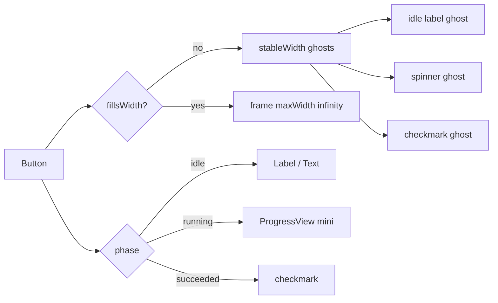

# AsyncActionButton

**File:** [`apps/native/WolfWave/Views/Shared/AsyncActionButton.swift`](../../apps/native/WolfWave/Views/Shared/AsyncActionButton.swift)

## Purpose

One button that owns the whole lifecycle of one `async` action: it swaps its
label for a spinner while the work runs, disables itself so the action cannot be
double-fired, and shows a brief checkmark on success.

This is the macOS-native shape of the pattern (App Store "Get", Xcode, System
Settings): the spinner **replaces** the label rather than sitting beside it, and
the control never changes width between states.

Use it wherever a button's action is genuinely awaited. Do **not** use it for a
button that fires a `Task` and returns immediately, or whose "done" signal
arrives later from a notification (Twitch join/leave is the standing example, and
keeps its own `isConnecting` flag for exactly that reason). A spinner that stops
before the work does is worse than no spinner.

## API

```swift
AsyncActionButton(
    title: String,
    systemImage: String? = nil,
    role: ButtonRole? = nil,
    style: Style = .bordered,
    size: ControlSize = .small,
    isDisabled: Bool = false,
    tint: Color? = nil,
    labelSize: CGFloat = DSFont.Size.body,
    fillsWidth: Bool = false,
    showsSuccess: Bool = true,
    successDuration: TimeInterval = 2.0,
    accessibilityIdentifier: String? = nil,
    action: @escaping () async throws -> Void
)
```

| Param | Type | Notes |
|---|---|---|
| `title` | `String` | Idle label, and the VoiceOver label in every phase |
| `systemImage` | `String?` | Leading SF Symbol on the idle label |
| `role` | `ButtonRole?` | `.destructive` paints the label `DSColor.error`, never a red fill (see `DestructiveButton`) |
| `style` | `Style` | `.bordered` / `.borderedProminent` / `.borderless` |
| `size` | `ControlSize` | `.small` for settings rows, `.regular` for full-width cards |
| `isDisabled` | `Bool` | Caller-owned disable reason. OR'd with the in-flight disable |
| `tint` | `Color?` | Semantic tint (green approve, orange hold). Nil keeps the neutral bordered look |
| `labelSize` | `CGFloat` | `DSFont.Size.body` for panes, `DSFont.Size.sm` for dense queue rows |
| `fillsWidth` | `Bool` | Stretch to the container. Skips the width lock, which a stretched button does not need |
| `showsSuccess` | `Bool` | `false` when the result is already visible on screen (a row appears, a banner clears) so the checkmark would be noise |
| `successDuration` | `TimeInterval` | Checkmark hold before reverting to idle |

### Phases

| Phase | Label | Interaction |
|---|---|---|
| `idle` | `title` (+ `systemImage`) | Enabled unless `isDisabled` |
| `running` | mini circular `ProgressView` | Disabled |
| `succeeded` | `checkmark` in `DSColor.success` | Enabled |

A thrown error returns straight to `idle` with no checkmark. Error
**presentation** stays with the caller, matching how the settings panes already
own their `CalloutBanner` or status string.

## Tokens used

- `DSFont.Size.body` (12) default label size, `DSFont.Size.sm` (11) for dense rows
- `DSColor.success` checkmark, `DSColor.error` destructive label
- `DSMotion.Duration.base` (0.22) phase cross-fade, skipped under Reduce Motion
- `DSSpace.s4` (12) preview stack spacing only

## Motion

- `.animation(.easeInOut(duration: DSMotion.Duration.base), value: phase)` on the
  label, so label → spinner → checkmark cross-fades instead of popping.
- Gated on `@Environment(\.accessibilityReduceMotion)`: the animation becomes
  `nil`, and the phases swap instantly.

## Anatomy



`stableWidth` measures all three ghost labels hidden in the background and pins
the button to the widest, so no phase change resizes the control or jitters the
row. A `fillsWidth` button takes the container's width instead, and skips the
lock because `stableWidth` ends in `fixedSize(horizontal: true)`, which would
fight the stretch.

## Accessibility

- `.accessibilityLabel(title)` stays constant across phases, so VoiceOver never
  loses the control's identity mid-action.
- `.accessibilityValue` reports `"Working"` while running and `"Done"` on
  success; the spinner and checkmark glyphs are `.accessibilityHidden(true)`.
- WCAG 1.4.1: the phase is never signalled by colour alone. The glyph changes,
  and the control's disabled state changes with it.
- Reduce Motion removes the cross-fade.
- The in-flight disable also covers keyboard activation, and `run()` guards a
  re-entrant call for the race where a key event lands before the disable applies.

## Do / Don't

- ✅ Use for anything the button actually `await`s: a Helix call, a MusicKit
  probe, a Keychain write, an actor round trip.
- ✅ Pass a caller-owned gate through `isDisabled` rather than wrapping the
  button in your own `.disabled`, so both reasons combine in one place.
- ✅ Set `showsSuccess: false` when the screen already shows the result.
- ❌ Don't use it inside `.alert` or `.confirmationDialog`. Those accept only
  plain `Button`s; a custom styled view will not render as a dialog button.
- ❌ Don't use it for a sync action that launches a detached `Task`. The spinner
  would end at the wrong moment.
- ❌ Don't wrap it in `.fixedSize` or your own `.frame(maxWidth: .infinity)`. Use
  `fillsWidth` instead.

## Example

```swift
AsyncActionButton(
    title: "Fetch link",
    style: .borderedProminent,
    showsSuccess: false
) {
    await fetchSongListLink()
}

AsyncActionButton(
    title: isHeld ? "Resume" : "Hold",
    systemImage: isHeld ? "play.fill" : "pause.fill",
    tint: isHeld ? .green : .orange,
    labelSize: DSFont.Size.sm,
    showsSuccess: false
) {
    await service?.setHold(!isHeld)
    refreshState()
}
```
