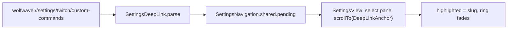

# DeepLinkAnchor

**File:** [`apps/native/WolfWave/Views/Shared/DeepLinkAnchor.swift`](../../apps/native/WolfWave/Views/Shared/DeepLinkAnchor.swift)

## Purpose
Marks a settings card as the `<section>` target of a `wolfwave://settings/<pane>/<section>` link. Gives the card a typed scroll id and flashes an accent ring over it when a link lands, so the user's eye goes to the right card without anything else on the pane changing.

## API
```swift
CustomCommandsCard(viewModel: twitchViewModel)
    .deepLinkSection("custom-commands")
```

| Param | Type | Notes |
|---|---|---|
| `slug` | `String` | Kebab-case (`[a-z0-9-]+`), unique within its pane. This is the public id the docs link to; renaming it breaks those links. Add a row to the Deep links table in `apps/docs/content/docs/settings.mdx` when you tag a card. |

`DeepLinkAnchor` (the `Hashable` id type) is `nonisolated` so the pure parser and tests can build one off the main actor.

## Tokens used
| Token | Use |
|---|---|
| `AppConstants.SettingsUI.cardCornerRadius` | Ring radius, matches `.cardStyle()` |
| `Color.accentColor` | Ring stroke (follows the system accent on purpose) |
| `DSMotion.Duration.pulseSlow` | Hold before the fade starts, and the fade length |

## Anatomy


## Accessibility
- The ring is `allowsHitTesting(false)` and carries no accessibility element; the card's own tree is untouched.
- Works under Reduce Motion: the fade is an opacity change, not movement.

## Do / Don't
- **Do** tag the card root (the view that gets `.cardStyle()`), so the ring hugs the card.
- **Do** keep slugs stable once the docs link to them.
- **Don't** derive a slug from a title string. Titles change; links must not.
- **Don't** tag a view inside a `Lazy*Stack`; an unmounted anchor cannot be scrolled to.

## Example
```swift
VStack(spacing: AppConstants.SettingsUI.sectionSpacing) {
    WebSocketServerCard(serverState: serverState, localNetworkIP: localNetworkIP)
        .deepLinkSection("server")
    WebSocketBrowserSourceCard(localNetworkIP: localNetworkIP)
        .deepLinkSection("browser-source")
}
```
