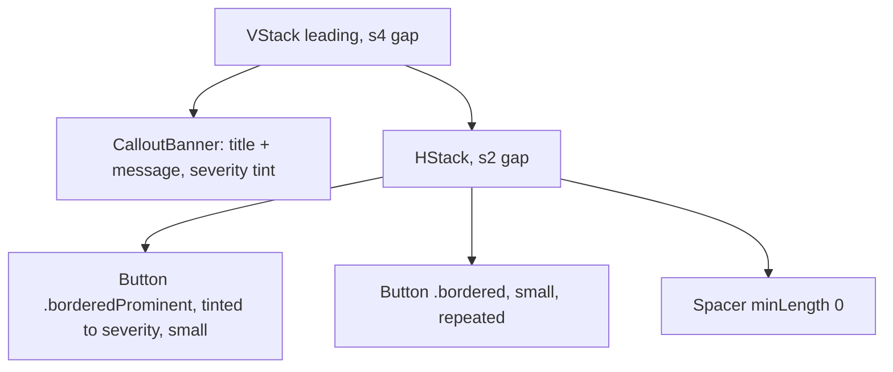

# ErrorCallout

**File:** [`apps/native/WolfWave/Views/Shared/ErrorCallout.swift`](../../apps/native/WolfWave/Views/Shared/ErrorCallout.swift)

## Purpose
Renders a `UserFacingError` as a tinted banner plus the buttons that fix it. This is the one surface for a failure the user can act on: what broke, why, what to do, and a control that does it.

It generalizes the two hand-rolled banner+CTA pairs that came before it (`MusicPermissionBanner` and the fileprivate `SongRequestHealthBanner`), so a new error surface never rebuilds the pair again. The banner itself is a plain `CalloutBanner`; actions sit **beside** it, never inside, per that component's rule.

Use `FieldValidationRow` instead when the failure is about what was typed into a field, and an `.alert` only when the user just asked for something that failed outright (an import, an export, a reset).

## API
```swift
ErrorCallout(error: viewModel.channelError) { action in
    viewModel.perform(action)
}
```

| Param | Type | Default | Notes |
|---|---|---|---|
| `error` | `UserFacingError` | (required) | Supplies title, message, severity, actions, and the accessibility identifier. |
| `onAction` | `(ErrorAction) -> Void` | `{ _ in }` | Called with the intent the user chose. The caller owns the behavior; the component never performs the fix itself. |

Severity maps to the banner style in one place: `.error` → `.error`, `.warning` → `.warning`, `.info` → `.info`. `UserFacingError` stays free of SwiftUI so it remains `Sendable` and testable without a renderer.

## Tokens used
- `DSSpace.s4` (12): banner-to-action-row gap
- `DSSpace.s2` (8): gap between buttons
- Tint comes from `CalloutBanner.Style` → `DSColor.error` / `.warning` / `.info`
- Corner radius and padding are inherited from `CalloutBanner`

## Anatomy


## Accessibility
- The root is `.accessibilityElement(children: .contain)` with the label from `UserFacingError.accessibilityLabel`, which combines title and message. The real reason is spoken, never left to a tooltip.
- Identifier is `errorCallout.<error.id>`; each button appends `.action.<action.id>`. A state that never renders therefore fails its test rather than passing invisibly.
- A waiting action (`retryAfter`) is `.disabled`, so the countdown is conveyed by state, not color alone.

## Do / Don't
- ✅ Put the recovery action on the error itself, so the fix travels with the message.
- ✅ Let the first action be the obvious next step; it renders filled.
- ✅ Omit `.reconnectTwitch` when the sign-in verified fine — offering it wastes the user's time.
- ❌ Don't put buttons inside `CalloutBanner`. They are siblings.
- ❌ Don't interpolate a status code, `OSStatus`, or `localizedDescription` into the title.
- ❌ Don't use this for a value the user typed. That's `FieldValidationRow`.
- ❌ Don't render one for a state the app recovers from on its own a second later.

## Example
```swift
if let error = viewModel.connectionError {
    ErrorCallout(error: error) { viewModel.perform($0) }
}
```
