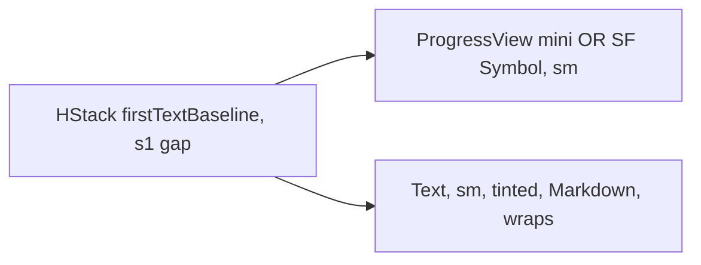

# FieldValidationRow

**File:** [`apps/native/WolfWave/Views/Shared/FieldValidationRow.swift`](../../apps/native/WolfWave/Views/Shared/FieldValidationRow.swift)

## Purpose
Inline validation feedback rendered directly under a text field: verifying, verified, wrong value, or the check itself failed.

Replaces three hand-rolled indicators that had drifted apart — the Twitch channel field, its diverged copy in the onboarding Twitch step, and the Stream Widgets token field. Between them they used three different error glyphs (`exclamationmark.octagon.fill`, `xmark.circle.fill`, `exclamationmark.circle.fill`) and raw `.red` / `.orange` instead of the semantic tokens.

The behavior that matters: `.failed` shows the real reason **inline**. The Twitch field used to render "Couldn't check channel" and hide the actual cause in a `.help()` tooltip, invisible to anyone not hovering.

## API
```swift
TextField("yourchannel", text: $channel)
FieldValidationRow(state: viewModel.channelValidation)
```

| State | Renders | Tint |
|---|---|---|
| `.idle` | nothing | — |
| `.validating(String)` | mini `ProgressView` + text | `.secondary` |
| `.valid(String)` | `checkmark.circle.fill` + text | `DSColor.success` |
| `.invalid(String)` | `xmark.circle.fill` + text | `DSColor.error` |
| `.failed(UserFacingError)` | `exclamationmark.triangle.fill` + title and reason | severity-driven |

`.invalid` means the user can fix it by typing. `.failed` means the check could not complete, so it carries the whole error.

## Tokens used
- `DSFont.Size.sm` (11): glyph and text
- `DSSpace.s1` (4): glyph/text gap
- `DSColor.success` / `.error` / `.warning` / `.info` for tint — never literal `.red` / `.orange` / `.green`

## Anatomy


## Accessibility
- `.accessibilityElement(children: .combine)` with the glyph hidden; the label carries the full text, including the failure reason.
- Identifier is `fieldValidation.<case>`, or `fieldValidation.<error.id>` for `.failed`.
- Every state pairs a glyph with text, so nothing is conveyed by color alone (WCAG 1.4.1).

## Do / Don't
- ✅ Place it immediately under the field it describes.
- ✅ Say what to do next in the same sentence ("Check the spelling, then choose Join.").
- ✅ Use `.failed` when the lookup broke, `.invalid` when the value is wrong.
- ❌ Don't put the real reason in a `.help()` tooltip. That was the bug.
- ❌ Don't hand-roll another indicator with a fourth error glyph.
- ❌ Don't use raw system colors; the tint comes from the tokens.

## Example
```swift
VStack(alignment: .leading, spacing: DSSpace.s2) {
    TextField("yourchannel", text: $channel)
        .textFieldStyle(.roundedBorder)
    FieldValidationRow(state: viewModel.channelValidation)
}
```
