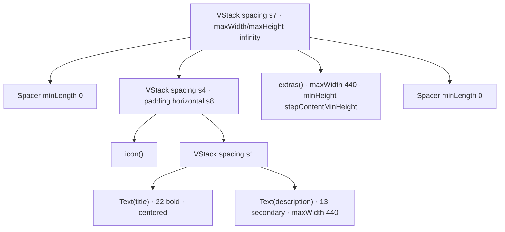

# OnboardingStepScaffold

**File:** [`apps/native/WolfWave/Views/Onboarding/Components/OnboardingStepScaffold.swift`](../../apps/native/WolfWave/Views/Onboarding/Components/OnboardingStepScaffold.swift)

## Purpose

Shared centered layout for every onboarding step, built so the icon lands at an identical
Y offset on all of them. Without it, each step sized itself to its own content and the
brand tile visibly jumped as the user clicked Next.

The trick is that the header block is constant-height (icon plus vertically fixed text) and
the extras slot has a minimum-height floor, so the header-plus-extras column measures the
same on every step. Balanced `Spacer(minLength: 0)` above and below then center that
constant column identically. A step whose extras exceed the floor (the Twitch device-code
state is the one that does) pushes the **bottom** spacer down and never shifts the header up.

## API

```swift
OnboardingStepScaffold(
    title: String,
    description: String,
    icon: () -> Icon,       // @ViewBuilder
    extras: () -> Extras    // @ViewBuilder
)
```

| Param | Type | Notes |
|---|---|---|
| `title` | `String` | H1 for the step. Rendered at 22pt bold, centered, multiline. |
| `description` | `String` | One-line pitch under the title. 13pt secondary, capped at 440pt wide. |
| `icon` | `@ViewBuilder () -> Icon` | Usually a [`BrandTile`](brand-tile.md). Any view works. |
| `extras` | `@ViewBuilder () -> Extras` | Step-specific controls (buttons, toggle cards, status). Pass `EmptyView()` when the step has none; the floor still reserves the space. |

Generic over `Icon: View` and `Extras: View`, so there is no `AnyView` erasure and the
layout stays statically typed.

## Tokens used

- `DSSpace.s7` (20) outer `VStack` spacing
- `DSSpace.s4` (12) icon-to-text spacing
- `DSSpace.s1` (4) title-to-description spacing
- `DSSpace.s8` (24) horizontal padding on both the header and extras blocks
- `DSFont.Size.x2xl` (22) `.bold` title
- `DSFont.Size.base` (13) description, `.secondary`
- `DSDimension.Onboarding.stepContentMinHeight` extras floor

The 440pt max width on the description and extras is a literal, not a token. It is a
measured line-length cap, not a reusable dimension.

## Anatomy



## Accessibility

- Both `Text` views use `.fixedSize(horizontal: false, vertical: true)`, so larger Dynamic
  Type sizes wrap to more lines instead of truncating.
- The scaffold adds no accessibility traits of its own. The title is a plain `Text`, not
  `.paneTitle()`, so it carries **no** `.isHeader` trait. If a step needs VoiceOver header
  semantics, add them at the call site.
- `Spacer(minLength: 0)` lets the column collapse rather than clip when the window is short.
- Order in the accessibility tree follows visual order: icon, title, description, extras.

## Do / Don't

- ✅ Use it for every interior onboarding step, so the icon never jumps between screens.
- ✅ Pass `EmptyView()` for `extras` on a step with no controls. The reserved floor is the point.
- ✅ Let tall extras grow. They consume the bottom spacer by design.
- ❌ Don't wrap it in another `Spacer`-balanced `VStack`. The scaffold already owns the vertical centering.
- ❌ Don't restyle the title at the call site. Welcome and Completion are the deliberate 26pt hero bookends; every other step stays at 22pt.
- ❌ Don't put a fixed-height container around it. It expects `maxHeight: .infinity` from its parent.

## Example

```swift
OnboardingStepScaffold(
    title: "Connect Discord",
    description: "Show what you're listening to on your Discord profile.",
    icon: {
        BrandTile(
            background: AnyShapeStyle(AppConstants.Brand.discord),
            glowColor: AppConstants.Brand.discord,
            glyph: Image(systemName: "bolt.fill")
                .font(.system(size: DSFont.Size.xl, weight: .bold))
                .foregroundStyle(.white)
        )
    },
    extras: {
        PillButton(
            background: AnyShapeStyle(AppConstants.Brand.discord),
            action: connectDiscord
        ) {
            Text("Connect Discord")
        }
    }
)
```

Both `#Preview` blocks in the source file ("With extras" and "No extras") demonstrate the
constant header offset side by side.
