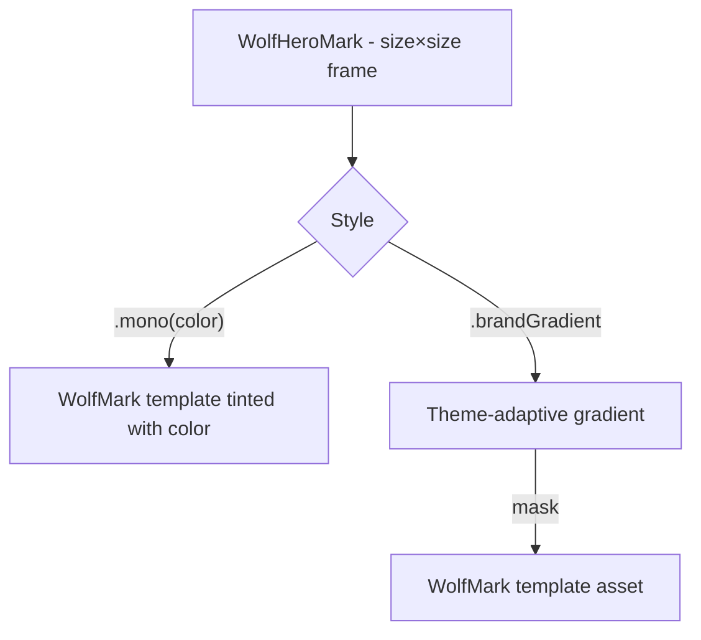

# WolfHeroMark

**File:** [`apps/native/WolfWave/Views/Onboarding/Components/WolfHeroMark.swift`](../../apps/native/WolfWave/Views/Onboarding/Components/WolfHeroMark.swift)

## Purpose

Scalable presentation wrapper around the canonical `WolfMark` template asset. Used on the onboarding Welcome and Completion screens without duplicating logo geometry in Swift.

## API

```swift
WolfHeroMark(size: 96, style: .brandGradient)
```

| Param | Type | Notes |
|---|---|---|
| `size` | `CGFloat` | Square render size in points. The preserved-vector asset stays crisp at any size. |
| `style` | `Style` | `.mono(Color)` for a flat template tint; `.brandGradient` for the theme-adaptive WolfWave gradient. Default `.mono(.primary)`. |

## Tokens used

- Light gradient: `AppConstants.Brand.wolfwaveGradientStart` → `AppConstants.Brand.wolfwaveGradientEnd`
- Dark gradient: `AppConstants.Brand.wolfwaveGradientEnd` → `DSColor.brand300`

## Anatomy


```mermaid
graph TD
  Root[WolfHeroMark - size×size frame] --> Style{Style}
  Style -- .mono(color) --> Mono[WolfMark template tinted with color]
  Style -- .brandGradient --> Gradient[Theme-adaptive gradient]
  Gradient -- mask --> Mark[WolfMark template asset]
```

## Accessibility

- Hidden from accessibility by default; visible screen titles already identify WolfWave.
- Color is decorative; the mark conveys brand, not state.
- The component has no internal motion. Host screens own entrance animation and Reduce Motion handling.

## Do / Don't

- ✅ Use `.brandGradient` on hero surfaces.
- ✅ Use `.mono(.primary)` or `.mono(.secondary)` for inline marks.
- ✅ Change geometry in `assets/logo.svg`, then regenerate or synchronize `WolfMark.svg` and the other documented derivatives.
- ❌ Don't redraw or paste the SVG path into Swift.
- ❌ Don't use partner colors as the WolfWave tint.

## Example

```swift
WolfHeroMark(size: 96, style: .brandGradient)
```
